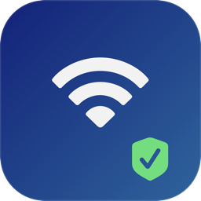
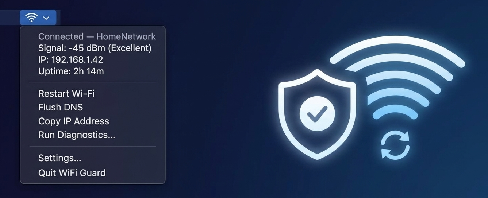
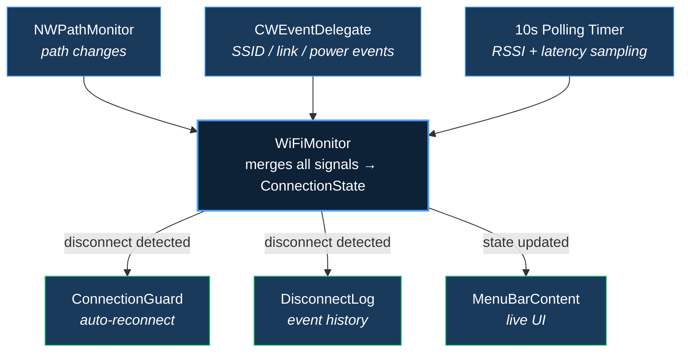
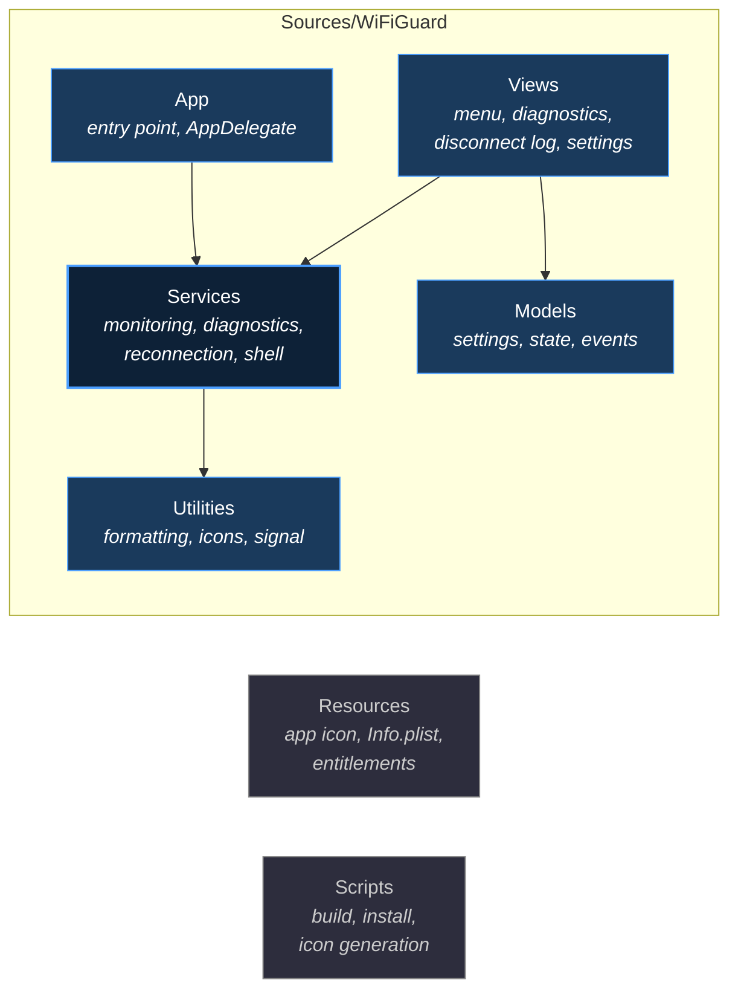

<div align="center">



# WiFi Guard

**A lightweight macOS menu bar app that monitors Wi-Fi health and auto-reconnects on drops.**

[](https://github.com/harishan-a/wifi-guard/actions/workflows/build.yml)
[](LICENSE)
[](https://www.apple.com/macos/sonoma/)
[](https://swift.org)

<br>



</div>

<br>

## Features

<table>
<tr>
<td width="50%">

#### Real-time Monitoring
Continuously tracks connection state, signal strength (RSSI), gateway latency, and uptime — all visible from the menu bar.

#### Auto-reconnect
Detects Wi-Fi drops and automatically reconnects to the last known network with configurable retry logic.

#### 6-layer Diagnostics
Comprehensive health check: Wi-Fi power, SSID, IP assignment, gateway reachability, DNS resolution, and internet connectivity.

</td>
<td width="50%">

#### Disconnect History
Logs every disconnect event with timestamps, durations, and reconnection status. Export to CSV for analysis.

#### Global Hotkey
Press <kbd>Ctrl</kbd> + <kbd>Opt</kbd> + <kbd>Cmd</kbd> + <kbd>W</kbd> from anywhere to instantly restart Wi-Fi.

#### Menu Bar Native
Runs entirely in the menu bar with no dock icon. Quick actions for restarting Wi-Fi, flushing DNS, and copying your IP address.

</td>
</tr>
</table>

## Installation

### Download

Download the latest `WiFiGuard.app.zip` from [**GitHub Releases**](https://github.com/harishan-a/wifi-guard/releases).

1. Unzip and move `WiFiGuard.app` to your Applications folder
2. Launch the app — it will appear in your menu bar
3. Grant Location permission when prompted (required for SSID access)

### Build from Source

```bash
git clone https://github.com/harishan-a/wifi-guard.git
cd wifi-guard
./Scripts/build.sh
open .build/WiFiGuard.app
```

## Usage

WiFi Guard lives in your menu bar. The icon reflects your current connection state:

| State | Icon | Description |
|:------|:-----|:------------|
| **Connected** | Filled Wi-Fi bars | Strong signal, everything healthy |
| **Weak signal** | Partial Wi-Fi bars | Connected but signal is degraded |
| **Disconnected** | Wi-Fi with slash | No connection — auto-reconnect kicks in |
| **Wi-Fi off** | No icon | Wi-Fi hardware is powered off |

Click the menu bar icon for live stats, quick actions, and access to diagnostics, disconnect log, and settings.

## How It Works

WiFi Guard uses an event-driven architecture built on three complementary mechanisms:



All shell commands use absolute paths (e.g., `/usr/sbin/networksetup`) with explicit argument arrays — no shell interpretation, no user input in commands.

## Architecture



## Requirements

| Requirement | Details |
|:------------|:--------|
| **macOS** | 14 (Sonoma) or later |
| **Hardware** | Apple Silicon or Intel with Wi-Fi |
| **Permissions** | Location Services (required by Apple for SSID access via CoreWLAN) |

## Contributing

Contributions are welcome! Please read [**CONTRIBUTING.md**](CONTRIBUTING.md) for guidelines on reporting bugs, requesting features, and submitting pull requests.

## License

This project is licensed under the MIT License. See [**LICENSE**](LICENSE) for details.

## Acknowledgments

Built with Apple's native frameworks:

[CoreWLAN](https://developer.apple.com/documentation/corewlan) ·
[Network](https://developer.apple.com/documentation/network) ·
[CoreLocation](https://developer.apple.com/documentation/corelocation) ·
[ServiceManagement](https://developer.apple.com/documentation/servicemanagement) ·
[Carbon](https://developer.apple.com/documentation/carbon)
